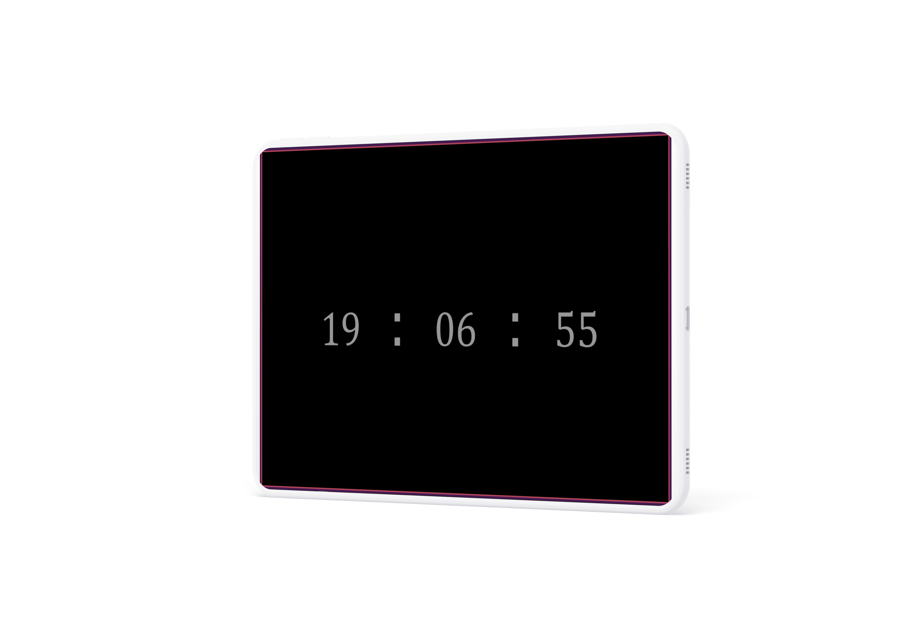
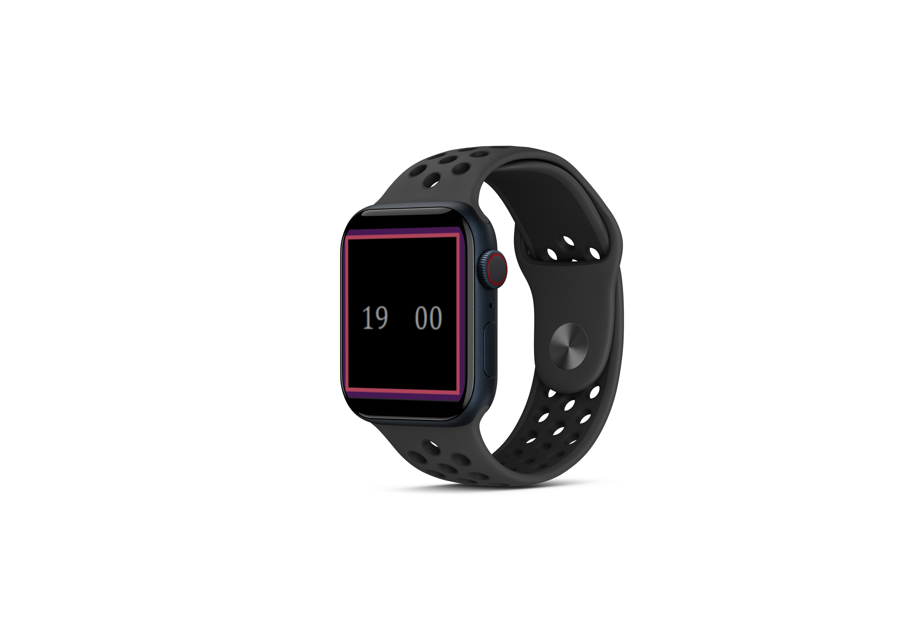

# Digital Clock

A simple digital clock created with HTML, CSS, and JavaScript to display the current time.

## Overview

This project provides a straightforward digital clock that continuously updates to show the current time. It's designed with a sleek and minimalistic look, making it easy to read and aesthetically pleasing.

## Screenshots

 

 
 

 
 #
 

 
 

 
## Usage

To use the digital clock, simply go to [live](#live-demo) your web browser. The clock will display the current time, including hours, minutes, and seconds, updating in real-time.

## Live Demo

You can try out the digital clock by visiting the [Live Demo](https://diii.netlify.app/).

## Technologies Used

- HTML: The structure of the web page.
- CSS: The styling of the digital clock.
- JavaScript: The logic to continuously update the time.

 
